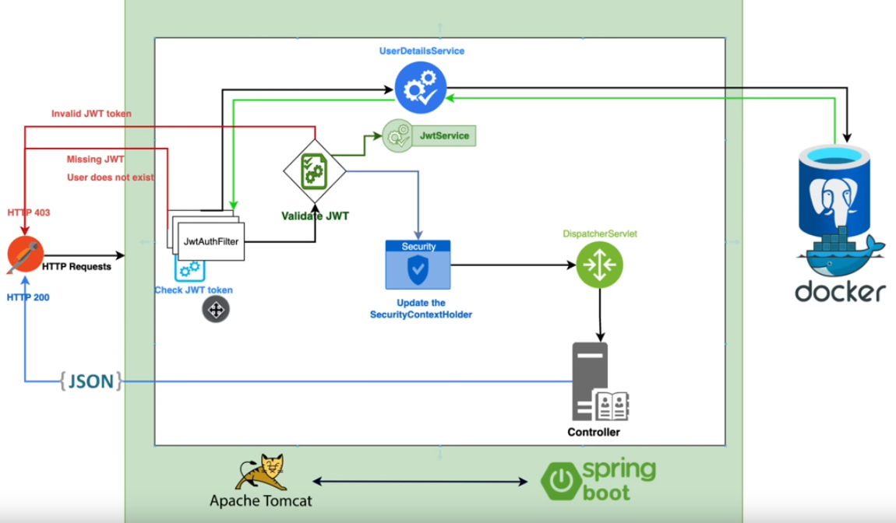

# spring-security-demo with JWT

You Can access _/api/v1/auth/register_ and _/api/v1/auth/login_ end points without any authentication.

If you want to access other endpoints you need send request with JWT token in header which you get from login endpoint.

